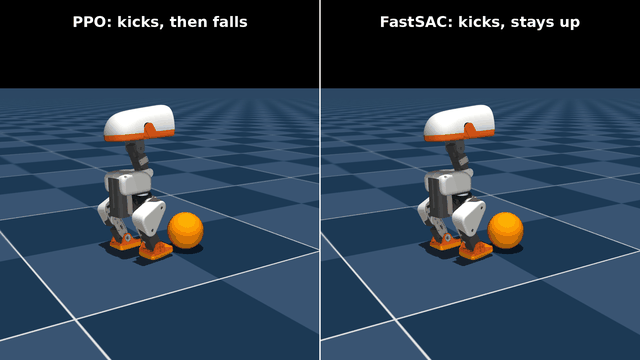

# microduck-kick

Teaching a Microduck to kick a ball in simulation, on a laptop, and checking whether
PPO is really the best algorithm for it.



*Same task, same ~4 h budget. Left: PPO. Right: FastSAC.
[1080p video](media/side_by_side.mp4)*

This is built on [pollen-robotics/microduck_rl](https://github.com/pollen-robotics/microduck_rl)
(Apache-2.0). The robot, the MuJoCo/mjlab environments and all the reward design are
theirs. What I added on top:

- **FastTD3 and FastSAC** training scripts that run on the same tasks as the default PPO
- an **evaluation script** that checks whether the duck is still standing after the kick,
  not just whether the task's own "fell over" check fired
- a small **thermal watchdog** so multi-hour training runs don't cook a laptop GPU
- the trained policies, training logs (`logs/`) and 1080p videos (`media/`) from my runs

## What I found

Right-foot ball kick, 1024 parallel envs, on an RTX 3060 laptop:

|                       | PPO             | FastSAC           | FastTD3                |
|-----------------------|:---------------:|:-----------------:|:----------------------:|
| training              | 1500 iters, ~4 h | 694 iters, ~4 h  | 160 iters, stopped at ~1 h |
| kicks the ball        | yes, 1.46 m/s   | yes, 1.40 m/s     | no                     |
| still standing after  | **0%**          | **99.8%**         | –                      |

PPO learned to kick as hard as it can and then fall on its back. The task only counts a
fall past 70° of tilt, and PPO settles at about 57°, so on paper it "never falls".
FastSAC kicks almost as hard and stays on its feet. FastTD3 got stuck standing still and
never found the kick in the hour it ran.

Full-length 1080p videos of each policy: [PPO](media/PPO.mp4), [FastSAC](media/FastSAC.mp4).

For reference, Pollen's own released kick policy also stays up 100% of the time, so the task
is solvable with PPO at a bigger budget; my smaller PPO run just locked into the collapse early.
This is one seed per method, so treat it as an interesting first result, not a verdict.
Details, numbers and caveats are in [docs/experiments.md](docs/experiments.md).

## Running it

Needs an NVIDIA GPU and [uv](https://docs.astral.sh/uv/).

```bash
uv sync

# PPO (the repo's default trainer)
uv run train Mjlab-BallKick-Flat-MicroDuck --env.scene.num-envs 1024 --agent.logger tensorboard

# FastSAC / FastTD3
uv run scripts/train_fastsac.py --task Mjlab-BallKick-Flat-MicroDuck --max-minutes 235
uv run scripts/train_fasttd3.py --task Mjlab-BallKick-Flat-MicroDuck --max-minutes 235

# evaluate exported policies (tilt, height, ball speed) and record 1080p videos
uv run scripts/eval_onnx.py --onnx PPO=path/to/ppo.onnx --onnx FastSAC=path/to/sac.onnx \
    --video-dir media
```

Trained checkpoints (`.pt`) are in the GitHub Release; the exported ONNX policies are in `logs/`.
On a laptop, wrap long runs in the watchdog: `scripts/run_guarded.sh train ...`
(see [docs/laptop-training.md](docs/laptop-training.md)).

## More

- [docs/experiments.md](docs/experiments.md): the full write-up
- [docs/laptop-training.md](docs/laptop-training.md): training on a laptop GPU without overheating it
- [docs/upstream-README.md](docs/upstream-README.md): the original microduck_rl README (all tasks, export, deployment)

## License

Apache-2.0, same as the upstream project. See [LICENSE](LICENSE).
