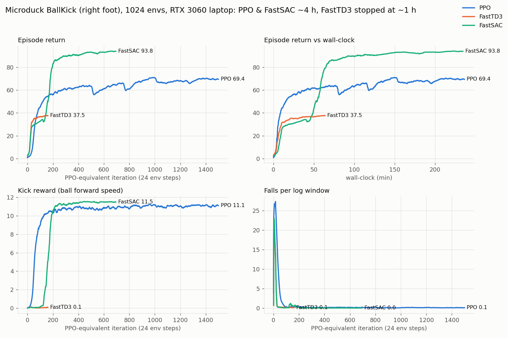

# Kick experiments: PPO vs FastTD3 vs FastSAC

All runs are on `Mjlab-BallKick-Flat-MicroDuck` (right-foot kick of a 70 mm / 15 g ball,
5 s episodes, ball-blind actor, asymmetric critic), on one RTX 3060 laptop GPU (6 GB).
Training logs and exported ONNX policies are under `logs/`; the `.pt` checkpoints are in the
GitHub Release (unpack the archive at the repo root and they land in the same `logs/` paths).

## Setup

Same for every method:

- 1024 parallel envs (the upstream recipe uses 4096; 1024 is what the laptop tolerates)
- same env config, rewards, domain randomization and step-based curriculum
- same 61D actor observation and 14D action, same `[1,61] -> [1,14]` ONNX export
- a thermal watchdog pausing training at 83 °C (see [laptop-training.md](laptop-training.md))
- roughly a 4 hour wall-clock budget

| Method  | Trainer                     | Where it stopped                     | Logs |
|---------|-----------------------------|--------------------------------------|------|
| PPO     | upstream `uv run train` (rsl_rl) | 1500 iterations, 3 h 55 min     | `logs/rsl_rl/ball_kick_right/` |
| FastTD3 | `scripts/train_fasttd3.py`  | stopped by me at iteration 160 (~1 h) | `logs/fasttd3/` |
| FastSAC | `scripts/train_fastsac.py`  | iteration 694, 235 min budget        | `logs/fastsac/` |

"Iteration" always means 24 env steps per env, so the curves line up with PPO and the
curriculum sees the same step counts.

The FastTD3 / FastSAC scripts follow the FastTD3 recipe: n-step returns (n=3), a C51
distributional clipped-double-Q critic, 32k batches, 2 updates per env step, AdamW with
weight decay, empirical observation normalization, bf16 autocast. They share the replay
buffer, critic and export code. FastSAC swaps the deterministic actor + hand-set noise for a
tanh-squashed Gaussian with an entropy bonus and automatic temperature tuning.

One detail that mattered for FastSAC: with a symmetric log-std range the initial policy std
comes out around 0.1, which explores far too little to ever touch the ball. I initialize it
at std = 1.0 instead, like PPO's `init_std`.

## Training curves

When the kick reward (ball forward speed term) first crossed a level:

| Method  | kick ≥ 5              | kick ≥ 10             |
|---------|-----------------------|-----------------------|
| PPO     | iteration 46 (4 min)  | iteration 103 (12 min) |
| FastSAC | iteration 149 (50 min) | iteration 178 (59 min) |
| FastTD3 | never                 | never                 |

- **PPO** finds the kick fast. Its large initial action noise flails the legs and hits the
  ball by accident early on. The two dips around iterations 500 and 1000 line up with the
  push curriculum stages.
- **FastTD3** learned to balance very quickly (full-length episodes by iteration 20), then
  settled into standing still. Its kick reward peaked at 0.11 around iteration 30 and
  decayed back to ~0.01. Standing pays steadily and its exploration noise (per-env std in
  [0.001, 0.4]) never produced kicks strong enough to learn from.
- **FastSAC** got stuck in the same place for ~100 iterations, but the entropy bonus kept it
  exploring; the kick appeared around iteration 130 and it caught up with PPO's kick reward
  by ~iteration 200.

Training-time returns are *not* comparable across these methods: PPO logs rewards while
sampling from its exploration noise, while FastSAC ends up nearly deterministic. So the
real comparison is the evaluation below.

## Evaluation

`scripts/eval_onnx.py` runs each exported policy deterministically in the task for 512
episodes, with the push curriculum held at its start (no pushes) or at its final stage
(full pushes). Besides the task's own metrics it measures what I actually care about:
trunk tilt and height at the end of each episode.

| | PPO, no pushes | PPO, full pushes | FastSAC, no pushes | FastSAC, full pushes |
|---|---:|---:|---:|---:|
| return | 80.8 | 80.0 | 94.7 | 87.9 |
| task "fell over" (> 70°) | 0.0% | 0.0% | 0.2% | 5.5% |
| peak ball speed | 1.46 m/s | 1.46 m/s | 1.40 m/s | 1.40 m/s |
| trunk tilt at episode end | 57.3° | 57.2° | 0.9° | 5.7° |
| trunk height at end / standing | 0.88 | 0.88 | 0.99 | 0.97 |
| **episodes ending upright** | **0.0%** | **0.0%** | **99.8%** | **93.2%** |
| time spent tilted > 30° | 94.5% | 94.1% | 0.0% | 1.6% |

"Upright" = tilt under 30° and height above 80% of the standing height.

### What PPO is doing

PPO kicks, then falls backwards and spends the rest of the episode leaning on its back and
head. The task's `fell_over` termination only fires past 70° of tilt, and PPO rests at about
57°, so it keeps collecting the kick reward and just gives up the small `upright` bonus.
You can see it in the per-term rewards (per second of episode, iterations 650-694):

| term | PPO | FastSAC |
|---|---:|---:|
| ball_forward_velocity | 10.86 | 11.50 |
| upright (max ≈ 2.0) | 0.09 | 1.94 |
| action_rate_l2 | -1.88 | -0.22 |
| pose_stand_neck | 0.39 | 0.96 |

It's a reward loophole, not a PPO bug. The upstream notes even warn about this
("RL optimizes the letter of the reward"). FastSAC just didn't fall into it in this run.

Videos (1920x1080, 50 fps): [`media/PPO.mp4`](../media/PPO.mp4), [`media/FastSAC.mp4`](../media/FastSAC.mp4)
and the side-by-side [`media/side_by_side.mp4`](../media/side_by_side.mp4)
(built with `scripts/make_media.py`).

## Caveats

- **One seed per method.** That's the biggest one. Another PPO seed might not find the
  loophole, another FastSAC seed might.
- **Unequal experience.** In the same wall-clock time FastSAC saw less than half of PPO's
  env steps (16.6k vs 36k per env). That also means it never trained through the full push
  stage (which starts at iteration 1000), yet it still ended upright in 93% of fully-pushed
  episodes.
- **Wall-clock favours PPO** on the kick itself (12 min vs 59 min to a strong kick).
- The kick reward of the same FastSAC policy came out 11.6 and 8.8 in two evaluation runs
  with different randomization draws; ball speed (1.40 m/s) and tilt were stable, so I
  trust those more.
- Simulation only, no real robot.
- Heads-up for `uv run play`: in play mode this task pushes the robot every 0.5-1 s instead
  of every 3-6 s, so it's a stress test rather than what the policy was trained for.

## What I'd do next

1. Three seeds per method on the unchanged task, to see if PPO's collapse is systematic.
2. A stricter variant of the task where a fall counts at ~40° of tilt, then train both again.
   That tells apart "FastSAC is a better learner here" from "FastSAC happened to dodge the
   loophole".
3. FastTD3 with bigger / temporally correlated (pink or OU) exploration noise and a longer
   random warm-up.

## Also in `logs/`

- `logs/rsl_rl/velocity/`: a 500-iteration flat walking run (PPO, 1024 envs) I used to check
  the whole pipeline on the laptop. It walks forward but never learned to turn.
- `logs/fasttd3/.../*_smoke`: a 10-iteration smoke test of the FastTD3 script.
